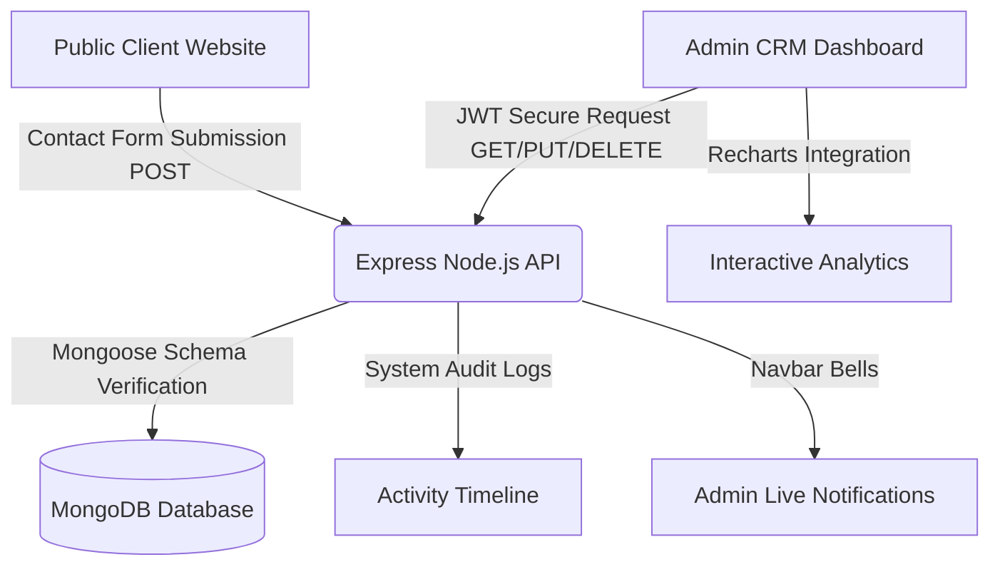

# NexusCRM - Enterprise Customer Relationship Management System

A production-ready, highly polished, full-stack Customer Relationship Management (CRM) platform designed for freelancers, agencies, startups, and sales teams to capture, monitor, schedule, and convert prospective client leads seamlessly.

The application comprises two distinct ecosystems:
1.  **Public Inbound Client Site**: A premium, responsive landing page offering validation-enabled contact inquiries that ingest lead data instantly into a centralized database.
2.  **Protected Admin CRM Dashboard**: A premium, state-of-the-art administrative portal utilizing secure JWT authentication, real-time activity timelines, follow-up calendars, Kanban boards, and Recharts graphical metrics.

---

## 🏗️ System Architecture



---

## ⚡ Main Capabilities & Features

### 1. Public Lead Capture Site
*   **Modern SaaS Landing Page**: Designed with elegant sky-blue gradients, high-contrast typography, and smooth page scrolling.
*   **Feature Columns**: Highlights web development, custom software engineering, cloud systems, and UI/UX design capabilities.
*   **Lead-Capture contact form**:
    *   Ingests `Full Name`, `Email Address`, `Phone Number`, `Company Name`, `Message`, and `Lead Source`.
    *   Form-validation safeguards against malformed email patterns, incorrect phone strings, or empty fields.
    *   Connects asynchronously using Axios to push data to the database and trigger notifications.

### 2. Protected Administrative CRM
*   **Robust JWT Authentication**: Protects critical business workflows behind route guards. Password validation is managed utilizing `bcrypt` hashing on save.
*   **Spreadsheet Lead Board**: Highly interactive table equipped with:
    *   Global fuzzy searching on name, email, or company.
    *   Lead-status filtering (`New`, `Contacted`, `Qualified`, `Proposal Sent`, `Negotiation`, `Converted`, `Closed`, `Lost`).
    *   Alphabetical, chronological, and corporate sorting.
    *   Pagination parameters.
*   **Kanban Pipeline**: A drag-and-drop status board showing cards grouped by sales pipeline stages.
*   **Lead Profiler & Activities Timeline**: Details notes creation, administrative follow-up schedule assignments, audit trails, and status modifications.
*   **Follow-Up Calendar**: Displays pending, completed, or overdue touchpoint deadlines on a clean calendar.
*   **Analytics Dashboard**: Visualizes business growth with Recharts metrics:
    *   Linear Lead Growth (Past 6 Months)
    *   Status Distribution Chart (Pie)
    *   Lead Source Distribution (Bar)
    *   Top-Level Cards (Total Leads, Converted Count, Conversion Rate %, Pending Followups, Estimated Revenue)

---

## 📂 Database Schemas (MongoDB collections)

### 👤 Admin User Collection
```javascript
{
  name: { type: String, required: true },
  email: { type: String, required: true, unique: true },
  password: { type: String, required: true, select: false } // Bcrypt encrypted
}
```

### 📈 Lead Collection
```javascript
{
  name: { type: String, required: true },
  email: { type: String, required: true, unique: true },
  phone: { type: String, required: true },
  company: { type: String, required: true },
  source: { type: String, default: 'Website Contact Form' },
  status: { type: String, enum: ['New', 'Contacted', 'Qualified', 'Proposal Sent', 'Negotiation', 'Converted', 'Closed', 'Lost'], default: 'New' },
  priority: { type: String, enum: ['Low', 'Medium', 'High'], default: 'Medium' },
  assignedAdmin: { type: mongoose.Schema.Types.ObjectId, ref: 'Admin' },
  notes: [{
    content: { type: String, required: true },
    createdBy: { type: String, required: true },
    createdAt: { type: Date }
  }],
  followUpDate: { type: Date },
  followUpStatus: { type: String, enum: ['Pending', 'Completed', 'Overdue'], default: 'Pending' }
}
```

### 📋 Activity Collection
```javascript
{
  leadId: { type: mongoose.Schema.Types.ObjectId, ref: 'Lead', required: false },
  adminId: { type: mongoose.Schema.Types.ObjectId, ref: 'Admin', required: false },
  adminName: { type: String, default: 'System' },
  action: { type: String, required: true },
  description: { type: String, required: true }
}
```

### 🔔 Notification Collection
```javascript
{
  adminId: { type: mongoose.Schema.Types.ObjectId, ref: 'Admin', required: true },
  title: { type: String, required: true },
  message: { type: String, required: true },
  type: { type: String, enum: ['info', 'warning', 'success', 'reminder'], default: 'info' },
  isRead: { type: Boolean, default: false }
}
```

---

## 🔌 API Endpoints Documentation

### Authentication Router (`/api/auth`)
| Method | Route | Description | Auth Required |
| :--- | :--- | :--- | :--- |
| **POST** | `/register` | Register a new system administrator account | No |
| **POST** | `/login` | Authenticate an admin and return JWT access token | No |
| **GET** | `/me` | Retrieve profile payload for the logged-in admin | Yes |
| **GET** | `/admins` | Retrieve names and emails of all system admins | Yes |
| **PUT** | `/me` | Update name, email, or password for the profile | Yes |

### Leads Router (`/api/leads`)
| Method | Route | Description | Auth Required |
| :--- | :--- | :--- | :--- |
| **POST** | `/` | Ingest a new inbound lead (used by Landing page) | **No** |
| **GET** | `/` | Query leads list (supports search, sort, filters, page) | Yes |
| **GET** | `/stats` | Aggregate statistical Recharts indicators & feeds | Yes |
| **GET** | `/:id` | Fetch specific lead record along with notes list | Yes |
| **PUT** | `/:id` | Update lead parameters (status, priority, assigned admin) | Yes |
| **DELETE** | `/:id` | Delete a lead and purge associated followups | Yes |
| **POST** | `/:id/notes` | Create a new time-stamped follow-up note block | Yes |

---

## 🛠️ Step-by-Step Installation

### Prerequisites
*   Node.js (v16.0.0 or higher)
*   MongoDB (installed locally on port `27017` or a MongoDB Atlas cloud cluster connection string)

### 1. Setup Environment
1. Clone the codebase and move into the project directory.
2. In the `server` directory, create a `.env` file based on `.env.example`:
```env
PORT=5000
MONGO_URI=mongodb://localhost:27017/crm_db
JWT_SECRET=your_super_secret_jwt_key_123
NODE_ENV=development
```

### 2. Seed Database
Clean your DB and inject the initial dashboard dataset (leads, activities, logs, followups, and default login profiles):
```bash
cd server
npm run seed
```
**Default Admin Credentials:**
*   **Email**: `admin@nexuscrm.com`
*   **Password**: `password123`

### 3. Spin Up Applications
Open two terminals to run the development servers simultaneously:

**Terminal 1 (Backend Server):**
```bash
cd server
npm install
npm run dev
```

**Terminal 2 (Frontend Client):**
```bash
cd client
npm install
npm run dev
```

The frontend client will boot at `http://localhost:5173/`, and the server will listen at `http://localhost:5000/`.

---

## 🚀 Cloud Deployment Instructions

### 1. Database Configuration (MongoDB Atlas)
1. Register for an account on [MongoDB Atlas](https://www.mongodb.com/cloud/atlas).
2. Establish a new M0 Free-Tier cluster and navigate to **Database Access** to set up a database user account.
3. Access **Network Access** and configure authorization (IP access whitelist) to allow connections from anywhere (`0.0.0.0/0`).
4. Select **Connect** -> **Drivers** and copy the resulting MongoDB URI connection string. Save this as your `MONGO_URI`.

### 2. Backend Hosting (Render)
1. Sign in to your dashboard on [Render](https://render.com/).
2. Select **New** -> **Web Service** and connect your GitHub repository.
3. Establish the configuration settings:
    *   **Root Directory**: `server`
    *   **Build Command**: `npm install`
    *   **Start Command**: `npm start`
4. Access the **Environment Variables** configuration sub-tab and set:
    *   `MONGO_URI` = `your_atlas_connection_string`
    *   `JWT_SECRET` = `your_secure_random_key`
    *   `NODE_ENV` = `production`
5. Deploy the service. Take note of your backend URL (e.g. `https://your-server.onrender.com`).

### 3. Frontend Hosting (Vercel)
1. Update `client/src/services/api.js` (or add client environment variables) to replace `http://localhost:5000/api` with your Render backend URL.
2. Sign in to [Vercel](https://vercel.com/) and choose **Add New** -> **Project**.
3. Link your GitHub repository.
4. Establish the configuration overrides:
    *   **Root Directory**: `client`
    *   **Framework Preset**: `Vite`
    *   **Build Command**: `npm run build`
    *   **Output Directory**: `dist`
5. Hit deploy. Vercel will host your landing page and control panel!

---

## 📄 License
Licensed under the [MIT License](LICENSE).

